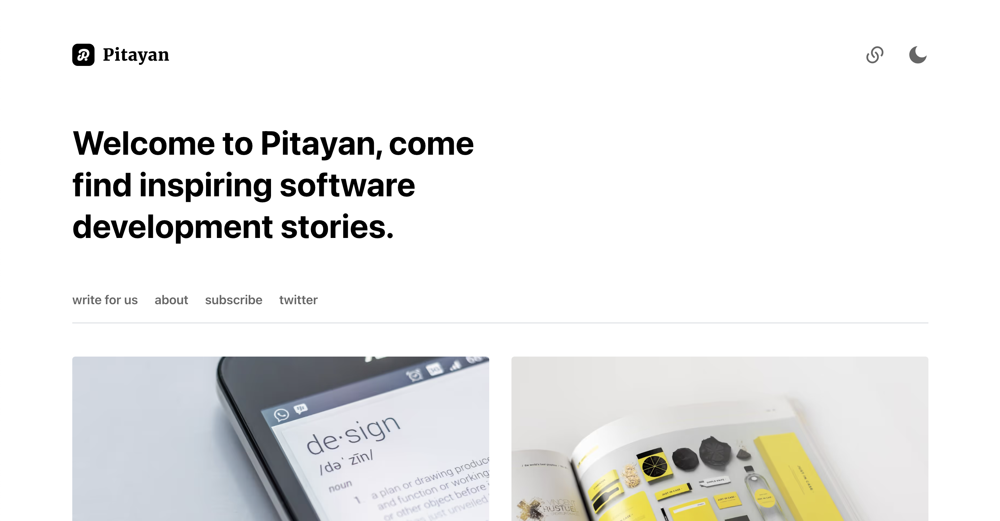

# gatsby-theme-pitayan

A theme plugin of Gatsby for those who enjoys building their blog site with minimalist design.



## Builtin Features

- Gatsby V4 ready
- SEO ready (site structured data & meta tags)
- Dark / light mode switch enabled via [Tailwindcss](https://tailwindcss.com)
- Source code highlight
- Embeddable Social media contents via [Oembed](https://oembed.com)
- Customizable in page site links
- Medium-like selection-popover for social sharing or copy
- Medium-like image popover magnifier
- Email newsletter subscription with [MailChimp](https://mailchimp.com)
- Multiple authors for single blog post
- And more...

## Table of Contents

- [Get Started](#get-started)
  - [Install Dependencies](#install-dependencies)
  - [Setup Folder](#setup-folder)
  - [Required Config files](#required-config-files)
  - [Plugin Options](#plugin-options)
  - [Site Resources](#site-resources)
- [Adding Contents](#adding-contents)
  - [Adding Site Metadata](#adding-site-metadata)
  - [Adding Authors](#adding-authors)
  - [Adding Posts](#adding-posts)
  - [Adding Site Logo & Cover Image](#site-logo-and-cover-image)
- [Full Fledged Example](#full-fledged-example)
- [Others](#others)
  - [Browser Support](#browser-support)
- [Contribute](#contribute)
- [Q&A](#q-a)
- [Road Map](#road-map)

Follow the guide to get familiar with setting up your Gatsby blog with this theme.

# Get Started

## Install Dependencies

Install the dependencies via Yarn or NPM.

```sh
$ npm install --save-dev gatsby @pitayan/gatsby-theme-pitayan

# or

$ yarn add gatsby @pitayan/gatsby-theme-pitayan
```

## Setup folder

The recommended project folder structure looks like this.

```
your-site
  ├── content/
  │ ├── authors/
  │ │   ├── avatars/
  │ │   │    ├── johndoe.jpg
  │ │   │    └── ...
  │ │   ├── johndoe.yml
  │ │   └── ...
  │ ├── posts/
  │ │   └── it-is-my-new-post/
  │ │       ├── images/
  │ │       │   └── post-cover.jpg
  │ │       └── index.mdx
  │ └── site/
  │     └── about-us/
  │         ├── images/
  │         │   └── my-site-cover.jpg
  │         └── index.md
  ├── node_modules/
  ├── src/
  │ └── assets/
  │     ├── SiteCover.png
  │     ├── SiteLogo.png
  │     └── my-custom-style.css
  ├── gatsby-config.js
  ├── postcss.config.js
  ├── tailwind.config.js
  └── package.json
```

## Required Config Files

The theme is built upon [Tailwindcss](https://tailwindcss.com) and [PostCSS](https://postcss.org). This means you'll need to put the following files under project root folder in order to compile the CSS source.

By default, the theme provides configs for [Tailwindcss](https://tailwindcss.com) & [PostCSS](https://postcss.org) to start quickly.

- tailwind.config.js
- postcss.config.js

Inside each of the config files, just export the theme's defaults if you don't need customization.

```
// tailwind.config.js
module.exports = require("@pitayan/gatsby-theme-pitayan/tailwind.config")


// postcss.config.js
module.exports = require("@pitayan/gatsby-theme-pitayan/postcss.config")
```

## Plugin Options

Use the plugin options to tune up your blog.

| Item                      | Default                           | Description                                                                 |
| ------------------------- | :-------------------------------- | :-------------------------------------------------------------------------- |
| siteAssets                | src/assets                        | The static assets for the site. e.g. Logo / Cover image                     |
| postsPerPage              | 10                                | How many posts to be displayed in each list page                            |
| mailChimpEndpoint         | "null"                            | The embeded form endpoint for your MailChimp account                        |
| mailChimpTimeout          | 3500                              | The AP request timeout for the MailChimp subscription                       |
| applyGatsbyRemarkPlugins  | () => defaultGatsbyRemarkPlugins  | Return your gatsby-plugin-remark plugins via this function. The argument of this function is the built-in plugins settings. |

## Site Resources

### Contents
The site content folders are where to keep your content like posts and authors and custom site pages. And what's more, the folder paths are not customizable.

```
├── content/
│ ├── authors/
│ ├── posts/
│ └── site/
```

### Static assets
As for the assets like site pictures / logos / style sheets, they can be kept under `src/assets` folder. You could change the folder path by adding a plugin option
of `siteAssets`. See details here [Plugin Options](#plugin-options).

```
├── src/
│ └── assets/
```

# Adding Contents

## Adding Site Metadata

This step is very essential before you get started with official blogging. Yet, adding site metadata is a case of cake, just follow the example below.

For details, see [Configurations](#configurations).

```js
// gatsby-config.js
module.exports = {
  ...,
  siteMetadata: {
    title: `A food blog`,
    name: `Food Blog`,
    description: `This is a blog about food`,
    siteUrl: `https://myfoodblog.com`,
    siteSlogan: `Welcome to the food blog, I know you are already hungry`,
    siteLinks: [
      {
        name: "privacy",
        url: "/privacy-policy",
        group: "site",
        internal: true,
      },
      {
        name: "about",
        url: "/about",
        group: "site,home",
        internal: true,
      },
    ]
  }
}
```

## Adding Authors

This theme uses [YAML](https://yaml.org) file to store and structure author data.

Authors data are managed under `content/authors/`. Author file format must be `{name}.yml`. And author avatar should be kept under `avatars/` (recommend to use the same name of the author file for better management).

```
├── content/
│ └── authors/
│     ├── avatars
│     │   └── john.jpg
│     └── john.yml
```

For the author's profile, make sure to have the following details.

Note: All fields are required.

| Item    | Type            | Description                                                                 |
| ------- | :-------------- | :-------------------------------------------------------------------------- |
| id      | String          | A unique string to be used as author posts page pathname                    |
| name    | String          | The author name                                                             |
| initial | String          | The preferred intial to be used as avatar if avatar picture is not provided |
| bio     | String          | A simple self introduction                                                  |
| joined  | String          | When this author started contributing posts                                 |
| avatar  | String          | The author's profile picture                                                |
| sns     | Array of Tuples | A list of contact methods including SNS / emails                            |

Example

```yaml
- id: daiyanze
  name: Yanze Dai
  initial: YD
  bio: Push at least one thing to its perfection even the entirety is yet incomplete
  joined: June 2020
  avatar: ./avatars/daiyanze.jpeg
  sns:
    - [stackoverflow, 7831025/daiyanze]
    - [facebook, yanze.dai]
    - [twitter, daiyanze]
    - [github, daiyanze]
    - [medium, "@daiyanze"]
    - [mailto, mailto:ginoalex8964@yahoo.com]
    - [url, https://daiyanze.com]
```

## Adding Posts

Every single post must provide a valid [front matter](https://jekyllrb.com/docs/front-matter/) which contains the following items

| Item        | Type                      | Required  | Description                                                           |
| ----------- | :------------------------ | :-------- | :-------------------------------------------------------------------- |
| title       | String                    | true      | The post title                                                        |
| author      | Array of String / string  | true      | The author name or the co-authors' names                              |
| date        | String                    | true      | The date of the post                                                  |
| categories  | Array of String           | true      | The categories to the post                                            |
| description | String                    | true      | A simple description of the post                                      |
| hero        | String                    | true      | The post's cover image. Better with a high resolution image           |
| slug        | Array of Tuples           | false     | The custom url of the post. It's useful when you need a different url |


```yml
---
title: The gatsby plugin options
author:
  - Yanze Dai
  - Gino Alex
date: 2022-03-31
categories:
  - sample
  - post
description: Just a post page that displays demo components
hero: images/demo_1.jpg
slug: posts/gatsby-plugin-options
---
```

## Adding Site Logo & Cover Image

It supports mainstream picture types such as `jpg` / `png` / `svg` etc.

Site Logo needs to have a file name of `SiteLogo`. And site cover needs to have a file name of `SiteCover`.

It is recommended to put your custom style sheets here as well.

```
├── src/
│ └── assets/
│     ├── SiteLogo.svg
│     ├── SiteCover.svg
│     └── style.css
```


# Full Fledged Example

There's an example site with all of the features under `packages/www`. This theme only provides very essential features of the blog itself, you might need to extend its functionalities for a greater purpose. Thus, the example site would be a good learning material about integrating other useful Gatsby plugins.

- [gatsby-plugin-feed](https://github.com/gatsbyjs/gatsby/tree/master/packages/gatsby-plugin-feed): Generates rss feed
- [gatsby-plugin-sitemap](https://github.com/gatsbyjs/gatsby/tree/master/packages/gatsby-plugin-sitemap): Generates the very necessary site map
- [@raae/gatsby-remark-oembed](https://github.com/queen-raae/gatsby-remark-oembed): Allows you to embed social media contents in an ["oEmbed"](https://oembed.com) way
- [gatsby-remark-responsive-iframe](https://github.com/gatsbyjs/gatsby/tree/master/packages/gatsby-remark-responsive-iframe): Makes iframe elements in the markdown content responsive, helpful when embedding social media contents

If you met a tricky part during implementation, do consider to look for answers from the example repo.

# Others

## Browser Support

Making sure all functions across different browsers is a hard-work. For now, it only supports the latest version of the major browsers. Do consider open an issue or provide a PR relating to browser compatibility.


# Contribute

This project is a [Monorepo](https://en.wikipedia.org/wiki/Monorepo). Which uses `npm` as package manager. As long as the Node supports npm workspaces then it should fit the contributing prerequisites.

To be verbose, the recommended Node version: `>= 16.5.0`.

```sh
# To start local development
$ npm -w packages/www run develop

# To clean caches
$ npm -w packages/www run clean

# To build local
$ npm -w packages/www run build

# To serve local build
$ npm -w packages/www run serve
```


# Q&A

1. Does it support Gatsby V3?

Sorry, it doesn't. This plugin has a peerDependency of `"gatsby":"^4.0.0-next"`.

2. Can I add a custom component to an existing page?

As for now, you could only add custom components to markdown articles. Existing pages like `home` / `posts` / `categories` / `authors` are not customizable yet.

3. How should I adjust theme for my blog?

You could add your own style sheets or update the definitions inside `tailwind.config.js`, but it has limited support and may cause expected behavior.

It's recommended to wait until the theme is tuned to a proper state (might introduce a big change).
By then, you'll be able to customize the theme by yourself. See [Road Map](#road-map)

4. How about importing data from [Contentful](https://www.contentful.com)?

Sorry, it's not available yet but it's on the [Road Map](#road-map).


# Road Map

- [ ] Make the theme into Tailwindcss Preset (Themable)
- [ ] Search function (perhaps with Algolia?)
- [ ] Keyboard accessibility (back & forward etc)
- [ ] Source from [Contentful](https://www.contentful.com)
- [ ] Comment system with utteranc.es or disquz
- [ ] Content text highlight (local notes)
