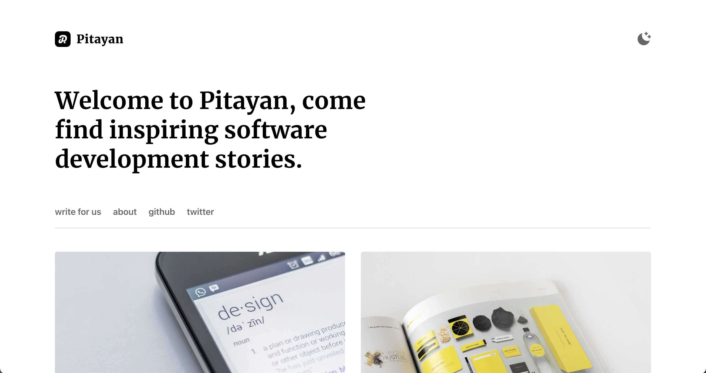

# gatsby-theme-pitayan

<p align="left">
  <a href="https://github.com/Pitayan/gatsby-theme-pitayan/blob/master/LICENSE">
    
  </a>
  <a href="https://www.npmjs.com/package/@pitayan/gatsby-theme-pitayan">
    
  </a>
  <a href="https://npmcharts.com/compare/@pitayan/gatsby-theme-pitayan?minimal=true">
    
  </a>
  <a href="https://npmcharts.com/compare/@pitayan/gatsby-theme-pitayan?minimal=true">
    
  </a>
  <a href="https://twitter.com/intent/follow?screen_name=pitayanblog">
    
  </a>
</p>

A theme plugin of Gatsby for those who enjoys building their blog site with minimalist design.




## Builtin Features

- Gatsby V4 ready
- SEO ready (site structured data & meta tags)
- Dark / light mode switch enabled via [Tailwindcss](https://tailwindcss.com)
- Source code highlight
- Customizable in page site links
- Medium-like selection-popover for social sharing or copy
- Medium-like image popover magnifier
- Email newsletter subscription with [MailChimp](https://mailchimp.com)
- Multiple authors for single blog post
- And more...

## Table of Contents

- [Installation](#installation)
- [Usage](#usage)
  - [Project Setup](#project-setup)
    - [Folder Structure](#folder-structure)
    - [Postcss and Tailwindcss config files](#postcss-and-tailwindcss-config-files)
  - [Configurations](#configurations)
    - [Gatsby Configs](#gatsby-configs)
    - [Plugin Options](#plugin-options)
  - [Adding Contents](#adding-contents)
    - [Adding Site Metadata](#adding-site-metadata)
    - [Adding Authors](#adding-authors)
    - [Adding Posts](#adding-posts)
    - [Adding Site Pages](#adding-site-pages)
    - [Adding Styles](#adding-styles)
    - [Adding Site Logo & Cover Image](#adding-site-logo--cover-image)
- [Full Fledged Example](#full-fledged-example)
- [Others](#others)
  - [Custom Events](#custom-events)
  - [Browser Support](#browser-support)
- [Contribute](#contribute)
- [Q&A](#qa)
- [Road Map](#road-map)

# Installation

Install the dependencies via Yarn or NPM.

```sh
$ npm install --save-dev gatsby @pitayan/gatsby-theme-pitayan react@17 react-dom@17

# or

$ yarn add gatsby @pitayan/gatsby-theme-pitayan react@17 react-dom@17
```

# Usage

## Project Setup

### Folder Structure
The necessary project folder structure looks like this. Make sure you've created all of them. For now, the folder paths are not configurable.

```
your-site
  ├── content/
  │ ├── authors/
  │ ├── posts/
  │ └── site/
  ├── src/
  │ └── assets/
```

### Postcss and Tailwindcss config files

The theme is built upon [Tailwindcss](https://tailwindcss.com) and [PostCSS](https://postcss.org). This means you'll need to put the following files under project root folder in order to compile the CSS source.

By default, the theme provides configs for [Tailwindcss](https://tailwindcss.com) & [PostCSS](https://postcss.org) to start quickly.

- tailwind.config.js
- postcss.config.js

Inside each of the config files, just export the theme's defaults if you don't need customization.

```js
// tailwind.config.js
module.exports = require("@pitayan/gatsby-theme-pitayan/tailwind.config")

// postcss.config.js
module.exports = require("@pitayan/gatsby-theme-pitayan/postcss.config")
```

## Configurations

Make sure to create a file `gatsby-config.js` under the project folder. All settings related to this theme can be configured under this file.

### Gatsby Configs

Add the theme to the `plugins`.

```js
{
  ...,
  plugins: [
    {
      resolve: `@pitayan/gatsby-theme-pitayan`
    }
  ]
}
```

### Plugin Options

Use the plugin options to tune up your blog.

| Item                     | Default                          | Description                                                                                                                 |
| ------------------------ | :------------------------------- | :-------------------------------------------------------------------------------------------------------------------------- |
| siteAssets               | src/assets                       | The static assets for the site. e.g. Logo / Cover image                                                                     |
| postsPerPage             | 10                               | How many posts to be displayed in each list page                                                                            |
| mailChimpEndpoint        | "null"                           | The embeded form endpoint for your MailChimp account                                                                        |
| mailChimpTimeout         | 3500                             | The AP request timeout for the MailChimp subscription                                                                       |
| applyGatsbyRemarkPlugins | () => defaultGatsbyRemarkPlugins | Return your gatsby-plugin-remark plugins via this function. The argument of this function is the built-in plugins settings. |

Example

```js
{
  ...,
  plugins: [
    {
      resolve: `@pitayan/gatsby-theme-pitayan`,
      options: {
        siteAssets: "src/assets",
        postsPerPage: 10,
        mailChimpEndpoint: "***",
        mailChimpTimeout: 3500,
        applyGatsbyRemarkPlugins(defaultGatsbyRemarkPlugins) => {
          // Don't forget to return the default gatsby-remark-plugins unless you hope to tune up all of the plugins by yourself
          return [

            ...defaultGatsbyRemarkPlugins,
          ]
        }
      }
    }
  ]
}
```

# Adding Contents

## Adding Site Metadata

This step is very essential before you get started with official blogging. All of the items in the table below are _required_.

| Item                | Description                                                                                                                   |
| ------------------- | :---------------------------------------------------------------------------------------------------------------------------- |
| title               | Your site title. This will be used as image alt                                                                               |
| name                | Your site name. This will be displayed in the top navigation bar beside the logo                                              |
| description         | Your site's description for SEO purposes                                                                                      |
| siteUrl             | Your site's official URL                                                                                                      |
| siteSlogan          | The slogan to be displayed on the home page                                                                                   |
| siteLinks           | A list of links to be displayed on the home links section or bottom footer                                                    |
| siteCookieConsent   | Containing properties of `title` & `description` & `readMore` for customizing the content of cookie consent prompt component  |
| siteSubscription    | Containing properties of `title` & `description` for customizing the content of the subscription component                    |

Example

```js
// gatsby-config.js
module.exports = {
  ...,
  siteMetadata: {
    title: `A food blog`,
    name: `Food Blog`,
    description: `This is a blog about food`,
    siteUrl: `https://myfoodblog.com`,
    siteSlogan: `Welcome to the food blog, I know you are already hungry`,
    siteLinks: [
      {
        name: "privacy",
        url: "/privacy-policy",
        group: "site",
        internal: true,
      },
      {
        name: "about",
        url: "/about",
        group: "site,home",
        internal: true,
      },
    ],
    // "siteCookieConsent" and "siteSubscription"'s properties have default values, leave them as empty strings to allow using the defaults
    // Override the defaults by adding your own inputs
    siteCookieConsent: {
      title: '',
      description: '',
      // For siteCookieConsent, the theme will automatically add "privacy" and "terms" like to cookie prompt if the `siteLinks` contains any matched items
      readMore: '',
    },
    siteSubscription: {
      title: '',
      description: '',
    },
  }
}
```

## Adding Authors

This theme uses [YAML](https://yaml.org) file to store and structure author data.

Authors data are managed under `content/authors/`. Author file format must be `{name}.yml`. And author avatar should be kept under `avatars/` (recommend to use the same name of the author file for better management).

```
├── content/
│ └── authors/
│     ├── avatars
│     │   └── john.jpg
│     └── john.yml
```

For the author's profile, make sure to have the following details.

Note: All fields are required.

| Item    | Type            | Description                                                                 |
| ------- | :-------------- | :-------------------------------------------------------------------------- |
| id      | String          | A unique string to be used as author posts page pathname                    |
| name    | String          | The author name                                                             |
| initial | String          | The preferred intial to be used as avatar if avatar picture is not provided |
| bio     | String          | A simple self introduction                                                  |
| joined  | String          | When this author started contributing posts                                 |
| avatar  | String          | The author's profile picture                                                |
| sns     | Array of Tuples | A list of contact methods including SNS / emails                            |

Example

```yaml
- id: daiyanze
  name: Yanze Dai
  initial: YD
  bio: Push at least one thing to its perfection even the entirety is yet incomplete
  joined: June 2020
  avatar: ./avatars/daiyanze.jpeg
  sns:
    - [stackoverflow, 7831025/daiyanze]
    - [facebook, yanze.dai]
    - [twitter, daiyanze]
    - [github, daiyanze]
    - [medium, "@daiyanze"]
    - [mailto, mailto:ginoalex8964@yahoo.com]
    - [url, https://daiyanze.com]
```

## Adding Posts

Create a new post in the `content/posts` folder. (Note: the file name can be anything you want)

```
├── content/
│ └── posts/
│     ├── my-new-post/
│     │   └── index.md
│     └── ...
```

Every single post must provide a valid [front matter](https://jekyllrb.com/docs/front-matter/) which contains the following items

| Item        | Type                     | Required | Description                                                           |
| ----------- | :----------------------- | :------- | :-------------------------------------------------------------------- |
| title       | String                   | true     | The post title                                                        |
| author      | Array of String / string | true     | The author name or the co-authors' names                              |
| date        | String                   | true     | The date of the post                                                  |
| categories  | Array of String          | true     | The categories to the post                                            |
| description | String                   | true     | A simple description of the post                                      |
| keywords    | String                   | true     | The keywords for the current page. Uses for SEO purposes              |
| hero        | String                   | true     | The post's cover image. Better with a high resolution image           |
| slug        | String                   | false    | The custom url of the post. It's useful when you need a different url |
| noIndex     | Boolean                  | false    | Tells searching engines stop crawling                                 |

Example

```yml
---
title: The gatsby plugin options
author:
  - Yanze Dai
  - Gino Alex
date: 2022-03-31
categories:
  - sample
  - post
description: Just a post page that displays demo components
hero: images/demo_1.jpg
slug: posts/gatsby-plugin-options
---
```

## Adding Site Pages

[Gatsbyjs](https://gatsbyjs.com) provides the feature of creating pages with custom React components. It offers the most flexibility of creating a page.
If you need to create a page with some complexities, this approach would be a good fit.

For some other common scenarios, the "site pages" can be created with Markdown files. Create such site pages in `content/site` folder

```
├── content/
│ └── site/
│     ├── terms-and-conditions/
│     │   └── index.md
│     └── ...
```

Similar to [Adding Posts](#adding-posts), "site pages" should have proper [front matter](https://jekyllrb.com/docs/front-matter/) like below.

| Item         | Type    | Required | Description                                                           |
| ------------ | :------ | :------- | :-------------------------------------------------------------------- |
| title        | String  | true     | The post title                                                        |
| date         | String  | true     | The date of the post                                                  |
| description  | String  | true     | A simple description of the post                                      |
| keywords     | String  | true     | The keywords for the current page. Uses for SEO purposes              |
| slug         | String  | false    | The custom url of the post. It's useful when you need a different url |
| noIndex      | Boolean | false    | Tells searching engines stop crawling                                 |
| displayTitle | Boolean | false    | Should this post display the heading title                            |

Example

```markdown
---
title: About
date: "2021-07-31"
description: "About our site"
keywords: about us
noIndex: true
displayTitle: true
---
```

## Adding Styles

Sometime you may need to write HTML directly in the post page. Since not all of the HTML tags (e.g. `<div>`) are styled by this theme, there might be some unexpected layout arrangements.
This theme provides some CSS utilities to let you directly adjust those raw HTML tags. It's also viable to approach this via [Tailwindcss](https://tailwindcss.com) style.

Here are the built-in CSS utilities class names. See their definitions in this file: [./packages/gatsby-theme-pitayan/src/assets/css/utilities.css](./packages/gatsby-theme-pitayan/src/assets/css/utilities.css)

- Post Width
  - .mark-w-sm
  - .mark-w-md
  - .mark-w-lg
  - .mark-w-2l
- Border
  - .border-t-white
  - .border-t-black
  - .text-inverted
  - .bg-inverted
  - .border-inverted

## Adding Site Logo & Cover Image

It supports mainstream picture types such as `jpg` / `png` / `svg` etc.

Site Logo needs to have a file name of `SiteLogo`. And site cover needs to have a file name of `SiteCover`.

It is recommended to put your custom style sheets here as well.

```
├── src/
│ └── assets/
│     ├── SiteLogo.svg
│     ├── SiteCover.svg
│     └── style.css
```

# Full Fledged Example

There's an example site with all of the features under `packages/www`. This theme only provides very essential features of the blog itself, you'll have to extend its functionalities yourself with other plugins. Thus, the example site would be a good learning material about integrating other useful Gatsby plugins.

This example site has integrated the following plugins:

- [gatsby-plugin-feed](https://github.com/gatsbyjs/gatsby/tree/master/packages/gatsby-plugin-feed): Generates rss feed
- [gatsby-plugin-sitemap](https://github.com/gatsbyjs/gatsby/tree/master/packages/gatsby-plugin-sitemap): Generates the very necessary site map
- [@raae/gatsby-remark-oembed](https://github.com/queen-raae/gatsby-remark-oembed): Allows you to embed social media contents in an ["oEmbed"](https://oembed.com) way
- [gatsby-remark-responsive-iframe](https://github.com/gatsbyjs/gatsby/tree/master/packages/gatsby-remark-responsive-iframe): Makes iframe elements in the markdown content responsive, helpful when embedding social media contents

# Others

## Custom Events

This theme introduces some custom events to allow 3rd party scripts (or your own scripts) to follow up the on-page behaviors.

| Item                        | Custom Event Detail Property                        | Description                                               |
| --------------------------- | :-------------------------------------------------- | :-------------------------------------------------------- |
| CUSTOM_EVENT_SUBSCRIPTION   | { email: string }                                   | Occurs when a user successfully subscribed to newsletters |
| CUSTOM_EVENT_TOGGLE_THEME   | { theme: 'dark' | 'light' }                         | Occurs when a user changes the theme dark <-> light       |
| CUSTOM_EVENT_SOCIAL_SHARING | { sns: 'Twitter' | 'Facebook' | 'Pocket' | 'copy' } | Occurs when a user shares to SNS / copes the post URL     |


## Browser Support

Making sure all functions across different browsers is a hard-work. For now, it only supports the latest version of the major browsers. Do consider open an issue or provide a PR relating to browser compatibility.

# Contribute

This project is a [Monorepo](https://en.wikipedia.org/wiki/Monorepo). Which uses `npm` as package manager. As long as the Node supports npm workspaces then it should fit the contributing prerequisites.

To be verbose, the recommended Node version: `>= 16.5.0`.

```sh
# To start local development
$ npm -w packages/www run develop

# To clean caches
$ npm -w packages/www run clean

# To build local
$ npm -w packages/www run build

# To serve local build
$ npm -w packages/www run serve
```

## Release Routines

Change branch to master and tag the commit.

- Run `npm -w packages/gatsby-theme-pitayan version patch|minor|major`
- Run `npm -w packages/gatsby-theme-pitayan publish --access public`
- Create a [Github release](https://github.com/Pitayan/gatsby-theme-pitayan/releases/new)

# Q&A

1. Does it support Gatsby V3?

Sorry, it doesn't. This plugin has a peerDependency of `"gatsby":"^4.0.0-next"`.

2. Can I add a custom component to an existing page?

As for now, you could only add custom components to markdown articles. Existing pages like `home` / `posts` / `categories` / `authors` are not customizable yet.

3. How should I adjust theme for my blog?

You could add your own style sheets or update the definitions inside `tailwind.config.js`, but it has limited support and may cause expected behavior.

It's recommended to wait until the theme is tuned to a proper state (might introduce a big change).
By then, you'll be able to customize the theme by yourself. See [Road Map](#road-map)

4. How about importing data from [Contentful](https://www.contentful.com)?

Sorry, it's not available yet but it's on the [Road Map](#road-map).

# Road Map

- [ ] Make the theme into Tailwindcss Preset (Themable)
- [ ] Search function (perhaps with Algolia?)
- [ ] Test cases (unit test & integration test)
- [ ] Keyboard accessibility (back & forward etc)
- [ ] Source from [Contentful](https://www.contentful.com)
- [ ] Comment system with utteranc.es or disquz
- [ ] Content text highlight (local notes)
