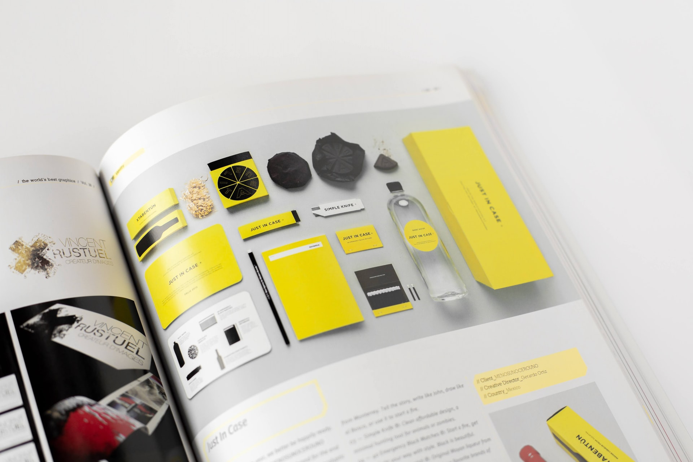
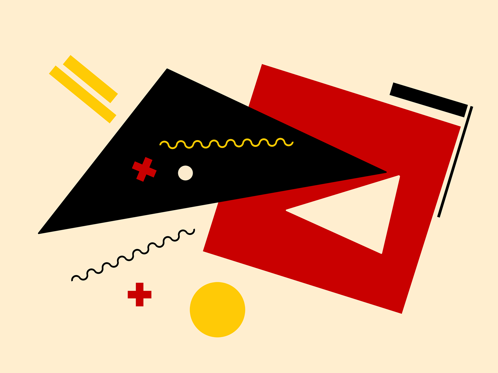

<div class="text-center text-6xl font-serif font-extrabold mb-48">
Style Guide
</div>

This is the style guide to let you get familiar with our theme design.

## 01. Typography

<br />
<br />
<br />
<br />

### Fonts

The font famliy follows the Tailwind default settings.
<br />
<br />

<div class="my-2 flex flex-wrap item-center justify-between mark-w-lg">
  <div class="font-sans grid grid-rows-2 place-item-start py-8">
    <div class="row-span-2 col-span-1 text-8xl">Aa</div>
    <b class="col-span-2 self-center">Sans Serif</b>
    <div class="col-span-3 tracking-widest break-all">
      <span>ABCDEFGHIJKLMNOPQRSTUVWXYZ</span><br />
      <span>abcdefghijklmnopqrstuvwxyz</span><br />
      <span>0123456789</span>
    </div>
  </div>

  <div class="font-serif grid grid-rows-2 place-item-start py-8">
    <div class="row-span-2 col-span-1 text-8xl">Aa</div>
    <b class="col-span-2 self-center">Serif</b>
    <div class="col-span-3 tracking-widest break-all">
      <span>ABCDEFGHIJKLMNOPQRSTUVWXYZ</span><br />
      <span>abcdefghijklmnopqrstuvwxyz</span><br />
      <span>0123456789</span>
    </div>
  </div>

  <div class="font-mono grid grid-rows-2 place-item-start py-8">
    <div class="row-span-2 col-span-1 text-8xl">Aa</div>
    <b class="col-span-2 self-center">Monospace</b>
    <div class="col-span-3 tracking-widest break-all">
      <span>ABCDEFGHIJKLMNOPQRSTUVWXYZ</span><br />
      <span>abcdefghijklmnopqrstuvwxyz</span><br />
      <span>0123456789</span>
    </div>
  </div>
</div>

<br />
<br />
<br />
<br />
<br />
<br />

### Headings

The headings ranges from `html•<h1>` to `html•<h6>`. The headings have a relative margin bottom according to their font size.
<br />
<br />

<h1>h1 Heading <code class="text-4xl">4xl</code></h1><br />
<h2>h2 Heading <code class="text-3xl">3xl</code></h2><br />
<h3>H3 Heading <code class="text-2xl">2xl</code></h3><br />
<h4>H4 Heading <code class="text-xl">xl</code></h4><br />
<h5>H5 Heading <code class="text-lg">lg</code></h5><br />
<h6>H6 Heading <code class="text-base">base</code></h6><br />

<br />
<br />
<br />
<br />
<br />
<br />
<br />

### Paragraphs

The common `html•<p>` tag. There's a `margin-bottom` (mb-4) for the gap between different paragraphs
<br />
<br />

<p>
Lorem ipsum dolor sit amet, consectetur adipiscing elit, sed do eiusmod tempor incididunt ut labore et dolore magna aliqua.
</p>
<p>
Ut enim ad minim veniam, quis nostrud exercitation ullamco laboris nisi ut aliquip ex ea commodo consequat. Duis aute irure dolor in reprehenderit in voluptate velit esse cillum dolore eu fugiat nulla pariatur.
</p>
<p>
Excepteur sint occaecat cupidatat non proident, sunt in culpa qui officia deserunt mollit anim id est laborum.
</p>

<br />
<br />
<br />
<br />
<br />
<br />
<br />

### Quotes

The font under `html•<quotes>` is set to <span class="font-serif font-bold">serif</span> and **_italic_** to distinguish with the normal article content.
<br />
<br />

> Your time is limited, so don’t waste it living someone else’s life. Don’t be trapped by dogma – which is living with the results of other people’s thinking.
> <br />
> -&nbsp;Hello

<br />
<br />
<br />
<br />
<br />
<br />
<br />

### Address

Similar to the blockquote, the `html•<address>` tag is also set to <span class="font-serif font-bold">serif</span> and **_italic_**
<br />

<address class="mark-w-md">
  <strong>Hello World!, Inc.</strong>
  <div>1-2-3 Alpha, Beta, Somewhere</div>
  <div>+00-11-2222-3333 (Main)</div>
  <a href="mailto:first.last@example.com" class="link">first.last@example.com</a>
</address>

<br />
<br />
<br />
<br />
<br />
<br />
<br />

### Semantic Elements

It's clear that semantic elements are more friendly to users and developers, isn't it?
<br />
<br />

<div class="mark-w-md flex flex-wrap">
  <div class="w-1/2">
    <div class="my-4">
      <abbr title="Internationalization">i18n</abbr><code class="ml-2">abbr</code>
    </div>
    <div class="my-4">
      <strong>Bold</strong><code class="ml-2">strong</code><code class="ml-2">b</code>
    </div>
    <div class="my-4">
      <cite>Citation</cite><code class="ml-2">cite</code>
    </div>
    <div class="my-4">
      <code>Hello World!</code><code class="ml-2">code</code>
    </div>
    <div class="my-4">
      <del>Deleted</del><code class="ml-2">del</code>
    </div>
    <div class="my-4">
      <em>Emphasis</em><code class="ml-2">em</code>
    </div>
    <div class="my-4">
      <i>Italic</i><code class="ml-2">i</code>
    </div>
    <div class="my-4">
      <ins>Inserted</ins><code class="ml-2">ins</code>
    </div>
    <div class="my-4">
      <kbd>Ctrl + S</kbd><code class="ml-2">kbd</code>
    </div>
  </div>
  <div class="w-1/2">
    <div class="my-4">
      <mark>Highlighted</mark><code class="ml-2">mark</code>
    </div>
    <div class="my-4">
      <ruby>漢<rt>kan</rt>字<rt>ji</rt></ruby><code class="ml-2">ruby</code>
    </div>
    <div class="my-4">
      <s>Strikethrough</s><code class="ml-2">s</code>
    </div>
    <div class="my-4">
      <samp>Sample</samp><code class="ml-2">samp</code>
    </div>
    <div class="my-4">
      Text <sub>Subscripted</sub><code class="ml-2">sub</code>
    </div><div class="my-4">
      Text <sup>Superscripted</sup><code class="ml-2">sup</code>
    </div>
    <div class="my-4">
      <time>20:00</time><code class="ml-2">time</code>
    </div>
    <div class="my-4">
      <u>Underline</u><code class="ml-2">u</code>
    </div>
    <div class="my-4">
      <var>x</var> = <var>y</var> + 2<code class="ml-2">var</code>
    </div>
  </div>
</div>
<br />
<br />
<br />
<br />
<br />
<br />
<br />

### Code

The code highlight is enabled by the community plugin: `gatsby-remark-vscode`
<br />

Hight lines

```html{1-3}
<div>
  <div>
    <p>gatsby-theme-pitayan is a theme for building blogs</p>
  </div>
</div>
```

JSX

```jsx {numberLines: true}
const App = () => {
  return <div>Hello World!</div>
}
```

Diff changes

```diff-ts {numberLines: true}
const add = (x: number, y: number) => {
-   return x + x;
+   return x + y;
}
```

Inline code highlight

This is an inline code `js•Array.prototype.concat.apply([], array)`

<br />
<br />
<br />
<br />
<br />
<br />
<br />

### Lists

<div class="mark-w-md flex flex-wrap w-full">
  <div class="sm:w-1/3 w-1/2">
    <ul>
      <li>List Item 1</li>
      <li>
      List Item 2
        <ul>
          <li>List Sub-Item 1</li>
          <li>List Sub-Item 2</li>
        </ul>
      </li>
      <li>List Item 3</li>
      <li>List Item 4</li>
      <li>List Item 5</li>
    </ul>
  </div>
  <div class="sm:w-1/3 w-1/2">
    <ol>
      <li>List Item 1</li>
      <li>
      List Item 2
        <ol>
          <li>List Sub-Item 1</li>
          <ol>
            <li>List Sub-Item 1</li>
          </ol>
        </ol>
      </li>
      <li>List Item 3</li>
      <li>List Item 4</li>
      <li>List Item 5</li>
    </ol>
  </div>
  <div class="sm:w-1/3 w-1/2">
    <dl>
      <dt>Item 1</dt>
      <dd>Description for Item 1</dd>
      <dt>Item 2</dt>
      <dd>Description for Item 2</dd>
      <dt>Item 3</dt>
      <dd>Description for Item 3</dd>
    </dl>
  </div>
</div>

<br />
<br />
<br />
<br />
<br />
<br />
<br />

## 02. Colors

<br />
<br />
<br />
<br />

### Primary

The theme uses Tailwind indigo as its primary color.

<br />
<br />

<div class="mark-w-md">
  <div class="text-sm w-20 text-center">
    <div class="h-32 w-20 rounded bg-indigo-500"></div>
    <b>bg-primary</b><br />
    <b>500</b>
  </div>
</div>
<br />
<br />
<br />
<br />
<br />
<br div/>
<br />

### Palletes

The default Tailwind colors
<br />
<br />

<div class="mark-w-md flex flex-col flex-wrap space-y-3 sm:flex-row text-sm text-center sm:space-y-0 sm:space-x-4">
  <div class="w-20">
    <div class="h-32 w-20 rounded bg-gray-500"></div>
    <b>bg-gray</b><br />
    <b>500</b>
  </div>
  <div class="w-20">
    <div class="h-32 w-20 rounded bg-red-500"></div>
    <b>bg-red</b><br />
    <b>500</b>
  </div>
  <div class="w-20">
    <div class="h-32 w-20 rounded bg-yellow-500"></div>
    <b>bg-yellow</b><br />
    <b>500</b>
  </div>
  <div class="w-20">
    <div class="h-32 w-20 rounded bg-green-500"></div>
    <b>bg-green</b><br />
    <b>500</b>
  </div>
</div>
<br />

<div class="mark-w-md flex flex-col flex-wrap space-y-3 sm:flex-row text-sm text-center sm:space-y-0 sm:space-x-4">
  <div class="w-20">
    <div class="h-32 w-20 rounded bg-blue-500"></div>
    <b>bg-blue</b><br />
    <b>500</b>
  </div>
  <div class="w-20">
    <div class="h-32 w-20 rounded bg-indigo-500"></div>
    <b>bg-indigo</b><br />
    <b>500</b>
  </div>
  <div class="w-20">
    <div class="h-32 w-20 rounded bg-purple-500"></div>
    <b>bg-purple</b><br />
    <b>500</b>
  </div>
  <div class="w-20">
    <div class="h-32 w-20 rounded bg-pink-500"></div>
    <b>bg-pink</b><br />
    <b>500</b>
  </div>
</div>

<br />
<br />
<br />
<br />
<br />
<br />
<br />
<br />
<br />

## 03. Elements

<br />
<br />
<br />
<br />

### Button

3 built-in button types: `Default` `Fill` `Ghost`
<br />
<br />

Default `html•<button>`

<div class="mark-w-md">
  <button>default button</button>
</div>
<br />
<br />
<br />

"Fill" button `html•<button class="fill-button">`

<div class="mark-w-md">
  <button class="fill-button">fill button</button>
</div>
<br />
<br />
<br />

"Ghost" button `html•<button class="ghost-button">`

<div class="mark-w-md">
  <button class="ghost-button">ghost button</button>
</div>
<br />
<br />
<br />

Disabled styles `html•<button disabled>disabled button</button>`

<div class="mark-w-md">
  <button disabled>normal disabled</button><br />
  <button class="fill-button" disabled>fill button disabled</button><br />
  <button class="ghost-button" disabled>ghost button disabled</button><br />
</div>

<br />
<br />
<br />
<br />
<br />
<br />
<br />

### Divider

A horizontal line `html•<hr>` is customized into 3 dots with margins to both ends (my-16).
<br />
<br />

Lorem ipsum dolor sit amet, consectetur adipiscing elit, sed do eiusmod tempor incididunt ut labore et dolore magna aliqua.

<hr />

Ut enim ad minim veniam, quis nostrud exercitation ullamco laboris nisi ut aliquip ex ea commodo consequat. Duis aute irure dolor in reprehenderit in voluptate velit esse cillum dolore eu fugiat nulla pariatur.

<br />
<br />
<br />
<br />
<br />
<br />
<br />

### Link

This is what a <a href="/styleguide">link</a> looks like among the text.
<br />
<br />

When a <a class="ring-2 ring-indigo-300 ring-offset-1" href="/styleguide">link</a> is focused

When a <a href="/styleguide" class="underline">link</a> is hovered

When a <a href="/styleguide" disabled>link</a> is disabled

<br />
<br />
<br />
<br />
<br />
<br />
<br />

### Input

The `html•<input>` element has 2 types: `default` and `outline`
<br />
<br />

<div class="mark-w-md">
  <input placeholder="This is a default input" type="text" />
</div>

<br />
<br />

<div class="mark-w-md">
  <input class="outline-input" placeholder="This is an outline input" type="text" />
</div>

<br />
<br />
<br />
<br />
<br />
<br />
<br />
<br />

## 04. Components

<br />
<br />
<br />
<br />

### Pagination

Active item font size `2xl` & font weight `semibold`
<br />
<br />

<ul class="pagination">
  <li class="pagination-item">
    <a href="#">Prev</a>
  </li>
  <li class="pagination-item">
    <a href="#">1</a>
  </li>
  <li class="pagination-item active">
    <a href="#">2</a>
  </li>
  <li class="pagination-item">
    <a href="#">3</a>
  </li>
  <li class="pagination-item">
    <a href="#">Next</a>
  </li>
</ul>

<ul class="pagination">
  <li class="pagination-item">
    <a href="#">Prev</a>
  </li>
  <li class="pagination-item">
    <a href="#">1</a>
  </li>
  <li class="pagination-item">
    <a href="#">2</a>
  </li>
  <li class="pagination-item active">
    <a href="#">3</a>
  </li>
</ul>

<ul class="pagination">
  <li class="pagination-item active">
    <a href="#">1</a>
  </li>
  <li class="pagination-item">
    <a href="#">2</a>
  </li>
  <li class="pagination-item">
    <a href="#">3</a>
  </li>
  <li class="pagination-item">
    <a href="#">Next</a>
  </li>
</ul>

<br />
<br />
<br />
<br />
<br />
<br />
<br />

### Subscription

Appears at the end of each article
<br />
<br />

<div class="mark-w-xl">
  <div class="subscription">
    <h3 class="subscription-title">Join our email list and get notified about new content</h3>
    <div class="subscription-content">
      Be the first to receive our latest content with the ability to opt-out at anytime. We promise to not spam your inbox or share your email with any third parties.
    </div>
    <form class="subscription-action">
      <input placeholder="your@email.com" name="email" type="email" class="outline-input md:max-w-md mb-8 md:mb-0" />
      <button class="fill-button ml-auto">Subscribe</button>
    </form>
  </div>
</div>

<br />
<br />
<br />
<br />
<br />
<br />
<br />

### Selection Popup

`html•<div class="selection-popup">` to share the selected text to SNS or copy to clipboard.
<br />
<br />

<div class="mark-w-md">
  <div class="selection-popup dark:text-black">
    <span class="px-2">Share: </span>
    <a class="px-2" href="#">
      <svg fill="currentColor" viewBox="0 0 20 20" class="h-6 w-6">
        <path d="M6.29 18.251c7.547 0 11.675-6.253 11.675-11.675 0-.178 0-.355-.012-.53A8.348 8.348 0 0020 3.92a8.19 8.19 0 01-2.357.646 4.118 4.118 0 001.804-2.27 8.224 8.224 0 01-2.605.996 4.107 4.107 0 00-6.993 3.743 11.65 11.65 0 01-8.457-4.287 4.106 4.106 0 001.27 5.477A4.073 4.073 0 01.8 7.713v.052a4.105 4.105 0 003.292 4.022 4.095 4.095 0 01-1.853.07 4.108 4.108 0 003.834 2.85A8.233 8.233 0 010 16.407a11.616 11.616 0 006.29 1.84"></path>
      </svg>
    </a>
    <a class="px-2" href="#">
      <svg fill="currentColor" viewBox="0 0 24 24" class="h-6 w-6"><path fill-rule="evenodd" d="M22.0367422,22 L17.8848745,22 L17.8848745,15.5036305 C17.8848745,13.9543347 17.85863,11.9615082 15.7275829,11.9615082 C13.5676669,11.9615082 13.237862,13.6498994 13.237862,15.3925291 L13.237862,22 L9.0903683,22 L9.0903683,8.64071385 L13.0707725,8.64071385 L13.0707725,10.4673257 L13.1276354,10.4673257 C13.6813927,9.41667396 15.0356049,8.3091593 17.0555507,8.3091593 C21.2599073,8.3091593 22.0367422,11.0753215 22.0367422,14.6734319 L22.0367422,22 Z M4.40923804,6.81585163 C3.07514653,6.81585163 2,5.73720584 2,4.40748841 C2,3.07864579 3.07514653,2 4.40923804,2 C5.73720584,2 6.81585163,3.07864579 6.81585163,4.40748841 C6.81585163,5.73720584 5.73720584,6.81585163 4.40923804,6.81585163 L4.40923804,6.81585163 Z M6.48604672,22 L2.32980492,22 L2.32980492,8.64071385 L6.48604672,8.64071385 L6.48604672,22 Z"></path>
      </svg>
    </a>
    <a class="px-2" href="#">
      <svg fill="currentColor" viewBox="0 0 24 24" class="h-6 w-6">
        <path d="M14 13.5h2.5l1-4H14v-2c0-1.03 0-2 2-2h1.5V2.14c-.326-.043-1.557-.14-2.857-.14C11.928 2 10 3.657 10 6.7v2.8H7v4h3V22h4v-8.5z"></path>
      </svg>
    </a>
    <a class="px-2" href="#">
      <svg xmlns="http://www.w3.org/2000/svg" class="h-6 w-6" fill="none" viewBox="0 0 24 24" stroke="currentColor">
        <path stroke-linecap="round" stroke-linejoin="round" stroke-width="2" d="M8 16H6a2 2 0 01-2-2V6a2 2 0 012-2h8a2 2 0 012 2v2m-6 12h8a2 2 0 002-2v-8a2 2 0 00-2-2h-8a2 2 0 00-2 2v8a2 2 0 002 2z" />
      </svg>
    </a>
  </div>
</div>

<br />
<br />
<br />
<br />
<br />
<br />
<br />
<br />
<br />
<br />

### Panel

Article list item `html•<div class="panel">`
<br />
<br />

<div class="mark-w-lg">
  <div class="grid relative grid-cols-1 md:grid-cols-2 gap-8">
    <div class="panel">
      <div class="panel-image">
        
      </div>
      <h3>This is a title</h3>
      <p class="panel-content">
        Ut enim ad minim veniam, quis nostrud exercitation ullamco laboris nisi ut aliquip ex ea commodo consequat.
      </p>
      <span class="panel-footer">Sept 26th, 2021 • 8 min read</span>
    </div>
    <div class="panel">
      <div class="panel-image">
        
      </div>
      <h3>This is a title</h3>
      <p class="panel-content">
        Ut enim ad minim veniam, quis nostrud exercitation ullamco laboris nisi ut aliquip ex ea commodo consequat. Duis aute irure dolor in reprehenderit in voluptate velit esse cillum dolore eu fugiat nulla pariatur.
      </p>
      <span class="panel-footer">Sept 25th, 2021 • 8 min read</span>
    </div>
  </div>
</div>
